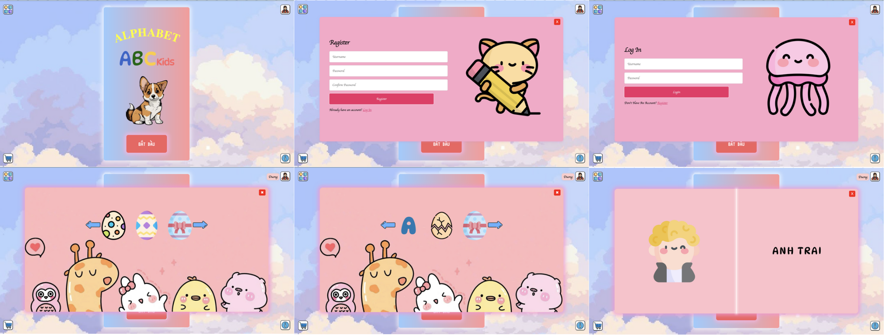

# Bé học chữ cái

## Project Overview
The **"Bé học chữ cái"** project is an interactive educational software designed for children to learn and recognize the alphabet in a visual and engaging way. Through interactive games, the application creates a fun learning environment that stimulates children's curiosity and memory.

## Project Goals
- **Familiarization with the Alphabet:** Help children aged 3-6 become familiar with the alphabet.
- **Lively Learning Environment:** Provide a dynamic learning space using vivid images and sound.
- **Enhanced Memory through Interaction:** Enable children to easily remember letters through interactive games and exercises.
- **Improved Letter Recognition and Language Skills:** Enhance letter recognition skills and overall language thinking.

## Main Features
1. **Alphabet Learning:** Displays each letter along with illustrative images and pronunciation.
2. **Interactive Games:** Children select the correct letter based on visual or audio hints.
3. **Child-Friendly Interface:** A simple and intuitive design tailored for young learners.
4. **Progress Tracking:** Saves learning progress so that parents can monitor their child’s development.
5. **SQLite Integration:** Stores letter data and related learning content in an SQLite database.

## Technologies Used
- **Programming Languages:** JavaScript (for user interactions), HTML, CSS.
- **Database:** SQLite (to store letter details and related content).
- **Development Tools:** Visual Studio Code.

## Target Audience
- Children aged 3-6 who are beginning to learn the alphabet.
- Parents and teachers looking to support early childhood education.
# Demo
 
